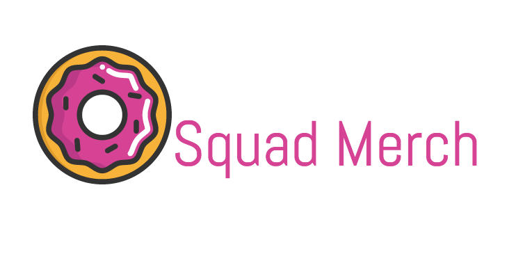

[](https://github.com/0Squad)

# 0Squad Merch API

An API to store products and orders data and allow customers to register as users and purchase our 0Squad merchandise.

- [FRONT END REPO](https://github.com/0Squad/0squadmerch)
- [DEPLOYED HEROKU SITE](https://murmuring-sea-28730.herokuapp.com/)
- [DEPLOYED APP](0sqaud.github.io/0squadmerch)

## API End-Points

| Verb   | URI Pattern            | Controller#Action |
|--------|------------------------|-------------------|
| POST   | `/sign-up`             | `users#signup`    |
| POST   | `/sign-in`             | `users#signin`    |
| PATCH  | `/change-password/:id` | `users#changepw`  |
| DELETE | `/sign-out/:id`        | `users#signout`   |
| POST  | `/orders` | `orders#create`  |
| PATCH  | `/orders` | `orders#update`  |
| GET | `/orders`        | `orders#index`   |
| GET   | `/orders/:id`             | `orders#show`    |
| DELETE   | `/orders/:id`             | `orders#destroy`    |
| GET  | `/products` | `products#index`  |
| GET | `/products/:id`        | `products#show`   |
| POST   | `/charges`             | `charges#create`    |

---

### User Actions

#### POST /sign-up

The `create` action expects a *POST* of `credentials` information identifying a new user to create using `getFormFields`:

```html
<form>
  <input name="credentials[email]" type="text" value="la@example.email">
  <input name="credentials[password]" type="password" value="an example password">
  <input name="credentials[password_confirmation]" type="password" value="an example password">
</form>
```
Request:

```sh
curl http://localhost:4741/sign-up \
  --include \
  --request POST \
  --header "Content-Type: application/json" \
  --data '{
    "credentials": {
      "email": "'"${EMAIL}"'",
      "password": "'"${PASSWORD}"'",
      "password_confirmation": "'"${PASSWORD}"'"
    }
  }'
```

```sh
EMAIL='laur@en.com' PASSWORD='lauren' sh scripts/sign-in.sh
```

Response:

```md
HTTP/1.1 201 Created
Content-Type: application/json; charset=utf-8

{
  "user": {
    "id": 1,
    "email": "laur@en.com"
  }
}
```

#### POST /sign-in

Request:

```sh
curl http://localhost:4741/sign-in \
  --include \
  --request POST \
  --header "Content-Type: application/json" \
  --data '{
    "credentials": {
      "email": "'"${EMAIL}"'",
      "password": "'"${PASSWORD}"'"
    }
  }'
```

```sh
EMAIL='laur@en.com' PASSWORD='lauren' sh scripts/sign-in.sh
```

Response:

```md
HTTP/1.1 200 OK
Content-Type: application/json; charset=utf-8

{
  "user": {
    "id": 1,
    "email": "laur@en.com",
    "token": "BAhJIiVlZDIwZTMzMzQzODg5NTBmYjZlNjRlZDZlNzYxYzU2ZAY6BkVG--7e7f77f974edcf5e4887b56918f34cd9fe293b9f"
  }
}
```

#### PATCH /change-password/:id

Request:

```sh
curl --include --request PATCH "http://localhost:4741/change-password/$ID" \
  --header "Authorization: Token token=$TOKEN" \
  --header "Content-Type: application/json" \
  --data '{
    "passwords": {
      "old": "'"${OLDPW}"'",
      "new": "'"${NEWPW}"'"
    }
  }'
```

```sh
ID=1 OLDPW='lauren' NEWPW='queen' TOKEN='BAhJIiVlZDIwZTMzMzQzODg5NTBmYjZlNjRlZDZlNzYxYzU2ZAY6BkVG--7e7f77f974edcf5e4887b56918f34cd9fe293b9f' sh scripts/change-password.sh
```

Response:

```md
HTTP/1.1 204 No Content
```

#### DELETE /sign-out/:id

Request:

```sh
curl http://localhost:4741/sign-out/$ID \
  --include \
  --request DELETE \
  --header "Authorization: Token token=$TOKEN"
```

```sh
ID=1 TOKEN='BAhJIiVlZDIwZTMzMzQzODg5NTBmYjZlNjRlZDZlNzYxYzU2ZAY6BkVG--7e7f77f974edcf5e4887b56918f34cd9fe293b9f' ID=1 sh scripts/sign-out.sh
```

Response:

```md
HTTP/1.1 204 No Content
```

### Users

| Verb | URI Pattern | Controller#Action |
|------|-------------|-------------------|
| GET  | `/users`    | `users#index`     |
| GET  | `/users/1`  | `users#show`      |

#### GET /users

Request:

```sh
curl http://localhost:4741/users \
  --include \
  --request GET \
  --header "Authorization: Token token=$TOKEN"
```

```sh
TOKEN='BAhJIiVlZDIwZTMzMzQzODg5NTBmYjZlNjRlZDZlNzYxYzU2ZAY6BkVG--7e7f77f974edcf5e4887b56918f34cd9fe293b9f' sh scripts/users.sh
```

Response:

```md
HTTP/1.1 200 OK
Content-Type: application/json; charset=utf-8

{
  "users": [
    {
      "id": 2,
      "email": "bob@ava.com"
    },
    {
      "id": 1,
      "email": "ava@bob.com"
    }
  ]
}
```

#### GET /users/:id

Request:

```sh
curl --include --request GET http://localhost:4741/users/$ID \
  --header "Authorization: Token token=$TOKEN"
```

Response:

```md
HTTP/1.1 200 OK
Content-Type: application/json; charset=utf-8

{
  "user": {
    "id": 1,
    "email": "laur@en.com"
  }
}
```

### Order Actions

All order action requests must include a valid HTTP header `Authorization: Token token=<token>` or they will be rejected with a status of 401 Unauthorized.

For testing purposes, we created a master script in which we could hard-code the verb and our sign-in token (and sometimes the order ID) and simply run:
```sh
sh scripts/ordermaster.sh
```

#### create

The `create` action is a *POST* that creates a new order for the user signed in. It expects a POST of `order` specifying `complete` and `items`, which is an array of objects containing an item id number(`_id`), `name`, `price`, `description`, and `quantity`. We also get a virtual attribute, `orderPrice`, which takes the price of each item in the `items` array and multiplies it by the quantity for the respective item, and adds each item's product to get a total amount.

Request:

```sh
curl http://localhost:4741/orders \
  --include \
  --request POST \
  --header "Content-Type: application/json" \
  --header "Authorization: Token token=${TOKEN}" \
  --data '{
    "order": {
      "complete": false,
      "items": [
        {
          "_id": "980ru3290",
          "name": "shirt",
          "price": 19.99,
          "description": "cool shirt",
          "quantity": 2
        },
        {
          "_id": "80f0942",
          "name": "shoes",
          "price": 29.99,
          "description": "cheap jordans",
          "quantity": 1
        },
        {
          "_id": "uc89ewfee23",
          "name": "mug",
          "price": 9.99,
          "description": "#1 Dad",
          "quantity": 1
        }
      ]
    }
  }'
```

The response will have an HTTP status of 201 Created, and the body will contain JSON of the created order:
```json
{
  "order":{
    "__v":0,
    "updatedAt":"2017-03-09T14:24:31.707Z",
    "createdAt":"2017-03-09T14:24:31.707Z",
    "_owner":"58c04feba4f94105b4d374a5",
    "_id":"58c1659fd96d962fb8a3d20d",
    "complete":false,
    "items":[
      {
        "quantity":2,
        "description":"cool shirt",
        "price":19.99,
        "name":"shirt",
        "_id":"980ru3290"
      },
      {
        "quantity":1,
        "description":"cheap jordans",
        "price":29.99,
        "name":"shoes",
        "_id":"80f0942"
      },
      {
        "quantity":1,
        "description":"#1 Dad",
        "price":9.99,
        "name":"mug",
        "_id":"uc89ewfee23"
      }
    ],
    "orderPrice":79.96,
    "id":"58c1659fd96d962fb8a3d20d"
  }
}
```

#### index

The `index` action is a *GET* that retrieves all past orders.

Request:

```sh
curl http://localhost:4741/orders \
  --include \
  --request GET
  --header "Authorization: Token token=$TOKEN"
```

The response body will contain JSON containing an array of past orders, e.g.:

```json
{
  "orders":[
    {
      "_id":"58c05039a4f94105b4d374a6",
      "updatedAt":"2017-03-08T18:40:57.755Z",
      "createdAt":"2017-03-08T18:40:57.755Z",
      "_owner":"58c04feba4f94105b4d374a5",
      "__v":0,
      "complete":false,
      "items":[
        {
          "name":"tshirt",
          "price":"13",
          "description":"white tee",
          "img":"path",
          "_id":"58c05736e0a8d00e310fe959",
          "quantity":"1"
        },
        {
          "name":"sweatshirt",
          "price":"60",
          "description":"hoodie",
          "img":"path",
          "_id":"58c0574ce0a8d00e310fe95a",
          "Quantity":"1"
        },
        {
          "Name":"shoes",
          "Price":"50",
          "description":"blue shoes",
          "Img":"path",
          "_id":"58c0572ae0a8d00e310fe958",
          "Quantity":"1"
        }
      ],
      "orderPrice":123,
      "Id":"58c1d339d0745f4aaadc189c"
    },
    {
      "_id":"58c1d34ad0745f4aaadc189d",
      "updatedAt":"2017-03-09T22:12:26.014Z",
      "createdAt":"2017-03-09T22:12:26.014Z",
      "_owner":"58c04feba4f94105b4d374a5",
      "__v":0,
      "Complete":false,
      "Items":[
        {
          "Name":"tshirt",
          "Price":"13",
          "description":"white tee",
          "Img":"path",
          "_id":"58c05736e0a8d00e310fe959",
          "Quantity":"2"
        }
      ],
      "orderPrice":26,
      "Id":"58c1d34ad0745f4aaadc189d"
    }
  ]
}
```

#### show

The `show` action is a *GET* that retrieves a specific order from the order history.

Request:

```sh
curl http://localhost:4741/orders/${ID} \
  --include \
  --request GET \
  --header "Authorization: Token token=$TOKEN"
```

The response body will contain JSON containing a single order, e.g.:
```json
{
  "order":{
    "_id":"58c1d34ad0745f4aaadc189d",
    "updatedAt":"2017-03-09T22:12:26.014Z",
    "createdAt":"2017-03-09T22:12:26.014Z",
    "_owner":"58c04feba4f94105b4d374a5",
    "__v":0,
    "complete":true,
    "items":[
      {
        "name":"tshirt",
        "price":"13",
        "description":"white tee",
        "img":"path",
        "_id":"58c05736e0a8d00e310fe959",
        "quantity":"2"
      }
    ],
    "orderPrice":26,
    "id":"58c1d34ad0745f4aaadc189d"
  }
}
```

#### update

The `update` action is a *PATCH* that updates an order for a user who has authorization. It expects a PATCH of `order` specifying `items` and `complete`.

Request:
```sh
curl http://localhost:4741/orders/${ID} \
  --include \
  --request PATCH \
  --header "Content-Type: application/json" \
  --header "Authorization: Token token=${TOKEN}" \
  --data '{
    "order": {
      "items": [
        {
          "Name":"tshirt",
          "Price":"13",
          "description":"white tee",
          "Img":"path",
          "_id":"58c05736e0a8d00e310fe959",
          "Quantity":"1"
        }
      ],
      "complete": true
    }
  }'
```

If the request is successful, the response will have an HTTP status of 204 No Content.

If the request is unsuccessful, the response will have an HTTP status of 400 Bad Request.

#### destroy

The `destroy` action is a *DELETE* that deletes a past order for a user who has authorization.

Request:
```sh
curl http://localhost:4741/orders/${ID} \
  --include \
  --request DELETE \
  --header "Authorization: Token token=$TOKEN"
```

If the request is successful, the response will have an HTTP status of 204 No Content.

If the request is unsuccessful, the response will have an HTTP status of 400 Bad Request.

### Product Actions

For the time being, Product will be treated as a resource database. We bulk loaded data from a [CSV](https://github.com/0Squad/0squadmerch-api/blob/master/data/productsTakeTwo.csv) we made. Users can choose from the products provided to create orders. The `index` and `show` action requests are there so users can know what products we sell. Later down the line we may add an administrative user position that can create, update, or destroy products.

For testing purposes, we created a master script in which we could hard-code the verb and simply run:
```sh
sh scripts/master.sh
```

#### index

The `index` action is a *GET* that retrieves all products.

Request:
```sh
curl http://localhost:4741/products \
  --include \
  --request GET
```

The response body will contain JSON containing an array of products, e.g.:
```json
{
  "products":[
    {
      "_id":"58c2b7dd2023c6f5deb0e902",
      "name":"Shoes",
      "description":"Shoes with donuts on them",
      "price":50,
      "img":"https://s3.amazonaws.com/0squad-bucket/images/0_Squad_1.jpg",
      "id":"58c2b7dd2023c6f5deb0e902"
    },
    {
      "_id":"58c2b7dd2023c6f5deb0e903",
      "name":"T-shirt",
      "description":"White Tee shirt with 0Squad's logo",
      "price":13,
      "img":"https://s3.amazonaws.com/0squad-bucket/images/0_Squad_2.jpg",
      "id":"58c2b7dd2023c6f5deb0e903"
    }
  ]
}
```

#### show

The `show` action is a *GET* that retrieves a specific product.

Request:
```sh
curl http://localhost:4741/products \
  --include \
  --request GET
```

The response body will contain JSON containing an array of products, e.g.:
```json
{
  "products":[
    {
      "_id":"58c2b7dd2023c6f5deb0e902",
      "name":"Shoes",
      "description":"Shoes with donuts on them",
      "price":50,
      "img":"https://s3.amazonaws.com/0squad-bucket/images/0_Squad_1.jpg",
      "id":"58c2b7dd2023c6f5deb0e902"
    },
    {
      "_id":"58c2b7dd2023c6f5deb0e903",
      "name":"T-shirt",
      "description":"White Tee shirt with 0Squad's logo",
      "price":13,
      "img":"https://s3.amazonaws.com/0squad-bucket/images/0_Squad_2.jpg",
      "id":"58c2b7dd2023c6f5deb0e903"
    }
  ]
}
```

### Charge Actions

All charge action requests must include a valid HTTP header `Authorization: Token token=<token>` or they will be rejected with a status of 401 Unauthorized.

#### create

The `create` action is a *POST* that creates a new charge for the user signed in. It expects a POST of `charge` specifying `stripeToken`. For the purpose of this project, we wanted to avoid actually saving anybody's card information. Stripe creates a token with every charge, so our company could technically just use that token to charge someone's card and not run into liability issues. This `create` action simply gives us proof that we successfully stored the charge token.

Request:

```sh
curl http://localhost:4741/charges/${ID} \
  --include \
  --request POST \
  --header "Content-Type: application/json" \
  --header "Authorization: Token token=${TOKEN}" \
  --data '{
    "stripeToken": <some token>
  }'
```

The response will have an HTTP status of 201 Created, and the body will contain JSON of the created order:
```json
"charge": {
  "_id":"58c1d34ad0745f4aaadc189d",
  "updatedAt":"2017-03-09T22:12:26.014Z",
  "createdAt":"2017-03-09T22:12:26.014Z",
  "__v":0,
  "stripeToken":"<some token>"
}
```

### Scaffolding

For this project, we used [Andrew Goode's](https://github.com/akgoode) scaffold generator. The scaffold script allows us to create templates for a controller and a model for whichever resource we need. It expects a pluralized form of the  resource, and it will accept attributes. For example, by running
```node
node generate/scaffold.js products name:String price:Number description:String img:String
```
we were able to generate our products controller and model.

There is more information on Andrew's generator [here](https://github.com/akgoode/express-api-generator).

### Our Team Process

Initially, we tri-programmed all the different parts of the back-end and tested everything on the front-end together. Each morning we wrote our goals for the day to give us some sort of schedule. We typically had both front-end and back-end goals each day. In this first stage of the project, we switched off machines with each milestone, so one person would type while the other two gave feedback and evaluated the situation. Whenever we hit a wall, we would whiteboard together. Ultimately, we worked smoothly and efficiently as a team and were able to communicate via Slack, our project issue queues, or text-message on the next day's goals or ideas.

### Future Goals

We had a few reach goals while writing up our user stories:
Reach goals:
- Users can search for a specific item
- Users can recreate past orders
- Users can favorite an item
- Users can comment/review an item
- Users can share an item to social media
- Users can NOT enter a fake email address
- Users can enter a mailing address

### Technologies Used:
- MongoDB
- Mongoose
- Node.js
- Express.js
- [Stripe](https://stripe.com/)
